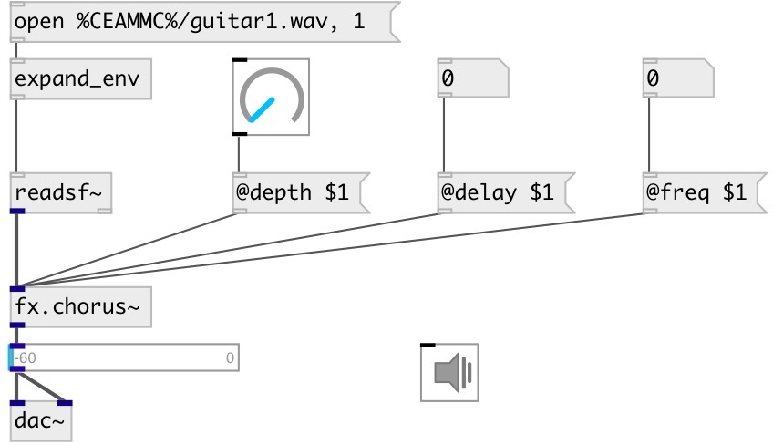

[index](index.html) :: [fx](category_fx.html)
---

# fx.chorus~

###### Chorus effect

*available since version:* 0.7

---

## methods:

* **reset**
same as reset 

## properties:

* **@delay** 
Get/set delay amount 
__type:__ float 
__units:__ ms 
__range:__ 0..200 
__default:__ 25 

* **@freq** 
Get/set effect freq 
__type:__ float 
__units:__ Hz 
__range:__ 0..10 
__default:__ 3 

* **@depth** 
Get/set effect depth 
__type:__ float 
__range:__ 0..1 
__default:__ 0.02 

* **@drywet** 
Get/set Ratio between processed signal (wet) and source signal 
__type:__ float 
__range:__ 0..1 
__default:__ 1 

* **@bypass** 
Get/set if set to 1 - bypass &#39;effected&#39; signal. 
__type:__ int 
__enum:__ 0, 1 
__default:__ 0 

* **@active** 
Get/set on/off dsp processing 
__type:__ int 
__enum:__ 0, 1 
__default:__ 1 

## inlets:

* input signal 
__type:__ audio 

## outlets:

* output
__type:__ audio 

## keywords:

[fx](keywords/fx.html)
[chorus](keywords/chorus.html)

**Authors:** Albert Graef, Serge Poltavsky

**License:** GPL3 or later

