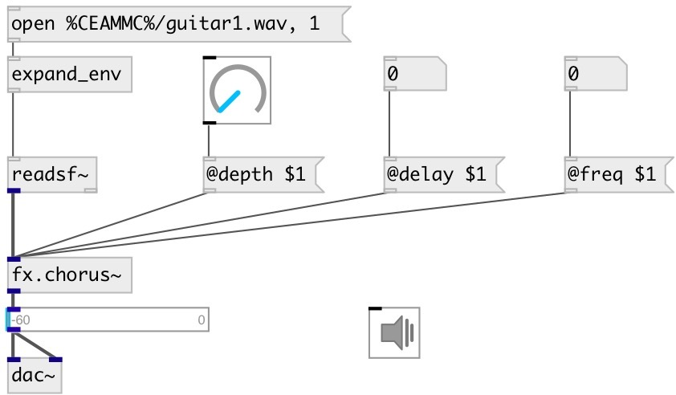

[index](index.html) :: [fx](category_fx.html)
---

# fx.chorus~

###### Chorus effect

*available since version:* 0.7

---

## methods:

* **reset**
reset object 

## properties:

* **@delay** 
Get/set delay amount 
_type:_ float 
_units:_ ms 
_range:_ 0..200 
_default:_ 25 

* **@freq** 
Get/set effect freq 
_type:_ float 
_units:_ Hz 
_range:_ 0..10 
_default:_ 3 

* **@depth** 
Get/set effect depth 
_type:_ float 
_range:_ 0..1 
_default:_ 0.02 

* **@drywet** 
Get/set Ratio between processed signal (wet) and source signal 
_type:_ float 
_range:_ 0..1 
_default:_ 1 

* **@bypass** 
Get/set bypass flag. If true: bypass &#39;effected&#39; signal. 
_type:_ bool 
_default:_ 0 

* **@active** 
Get/set on/off dsp processing 
_type:_ bool 
_default:_ 1 

* **@osc** (initonly)
Get/set OSC server name to listen 
_type:_ symbol 

* **@id** (initonly)
Get/set OSC address id. If specified, bind all properties to /ID/fx_chorus/PROP_NAME
osc address, if empty bind to /fx_chorus/PROP_NAME. 
_type:_ symbol 

## inlets:

* input signal 
_type:_ audio

## outlets:

* output 
_type:_ audio

## keywords:

[fx](keywords/fx.html)
[chorus](keywords/chorus.html)

**Authors:** Albert Graef, Serge Poltavsky

**License:** GPL3 or later

