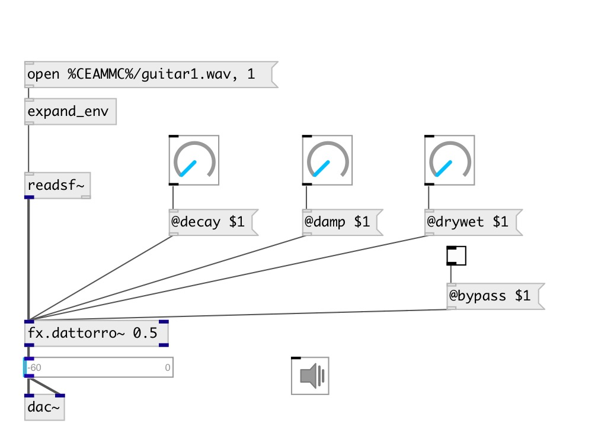

[index](index.html) :: [fx](category_fx.html)
---

# fx.dattorro~

###### dattorro reverb

*available since version:* 0.9.6

---

## information
Reverberator based on the Dattorro reverb topology with default reverb parameters from the original paper

## arguments:

* **DECAY**
decay rate, infinite decay = 1.0 
_type:_ float 

* **DRYWET**
proportion of mix between the original (dry) and &#39;effected&#39; (wet) signals 
_type:_ float 

## methods:

* **reset**
reset reverb 

## properties:

* **@decay** 
Get/set decay rate. Infinite decay = 1.0 
_type:_ float 
_range:_ 0..1 
_default:_ 0.5 

* **@damp** 
Get/set high-frequency damping. No damping = 0.0 
_type:_ float 
_range:_ 0..1 
_default:_ 0.0005 

* **@drywet** 
Get/set proportion of mix between the original (dry) and &#39;effected&#39; (wet) signals. 0 -
dry signal, 1 - wet 
_type:_ float 
_range:_ 0..1 
_default:_ 0.33 

* **@predelay** 
Get/set a delay operating on the &#39;wet&#39; signal. Large values will provide the impression
of a larger room 
_type:_ float 
_units:_ ms 
_range:_ 0..100 
_default:_ 40 

* **@idiff1** 
Get/set input diffusion factor 1 
_type:_ float 
_range:_ 0..1 
_default:_ 0.625 

* **@idiff2** 
Get/set input diffusion factor 2 
_type:_ float 
_range:_ 0..1 
_default:_ 0.75 

* **@bypass** 
Get/set bypass flag. If true: bypass &#39;effected&#39; signal. 
_type:_ bool 
_default:_ 0 

* **@active** 
Get/set on/off dsp processing 
_type:_ bool 
_default:_ 1 

* **@ddiff1** 
Get/set decay diffusion factor 1 
_type:_ float 
_range:_ 0..1 
_default:_ 0.5 

* **@ddiff2** 
Get/set decay diffusion factor 2 
_type:_ float 
_range:_ 0..1 
_default:_ 0.7 

* **@bw** 
Get/set band-width filter (pre filtering) 
_type:_ float 
_range:_ 0..1 
_default:_ 0.9995 

* **@osc** (initonly)
Get/set OSC server name to listen 
_type:_ symbol 

* **@id** (initonly)
Get/set OSC address id. If specified, bind all properties to /ID/fx_dattorro/PROP_NAME
osc address, if empty bind to /fx_dattorro/PROP_NAME. 
_type:_ symbol 

## inlets:

* left channel 
_type:_ audio
* right channel 
_type:_ audio

## outlets:

* output left 
_type:_ audio
* output right 
_type:_ audio

## keywords:

[fx](keywords/fx.html)
[reverb](keywords/reverb.html)

**Authors:** Serge Poltavsky

**License:** GPL3 or later

