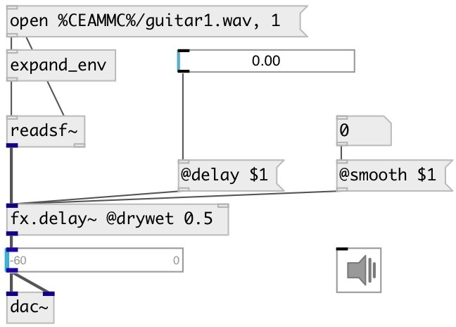

[index](index.html) :: [fx](category_fx.html)
---

# fx.delay~
**aliases:** [fx.sdelay\~]

###### smooth delay with a feedback control

*available since version:* 0.6

---

## information
delay that doesn&#39;t click and doesn&#39;t transpose when the delay time is changed

## arguments:

* **DELAY**
delay time 
_type:_ float 
_units:_ ms 

* **FEEDBACK**
feedback coefficient 
_type:_ float 

## methods:

* **reset**
clears delay line 

## properties:

* **@delay** 
Get/set echo time 
_type:_ float 
_units:_ ms 
_range:_ 0..6000 
_default:_ 1 

* **@feedback** 
Get/set feedback coefficient 
_type:_ float 
_range:_ 0..1 
_default:_ 0 

* **@filter** 
Get/set if true - apply filter to feedback signal 
_type:_ bool 
_default:_ 0 

* **@f_lpf** 
Get/set feedback low-pass filter cutoff frequency 
_type:_ float 
_units:_ Hz 
_range:_ 20..20000 
_default:_ 9000 

* **@f_hpf** 
Get/set feedback high-pass filter cutoff frequency 
_type:_ float 
_units:_ Hz 
_range:_ 20..20000 
_default:_ 300 

* **@compress** 
Get/set feedback compression factor. 0: means no compression, 1: limit feedback level. 
_type:_ float 
_range:_ 0..1 
_default:_ 0.5 

* **@c_thresh** 
Get/set feedback compression threshold level 
_type:_ float 
_units:_ db 
_range:_ -60..0 
_default:_ 0 

* **@c_attack** 
Get/set feedback compression attack time 
_type:_ float 
_units:_ ms 
_range:_ 0.1..100 
_default:_ 10 

* **@c_release** 
Get/set feedback compression release time 
_type:_ float 
_units:_ ms 
_range:_ 1..500 
_default:_ 50 

* **@smooth** 
Get/set interpolation time on delay time change, that prevents click and transpose, if
equal to 0 produces artifacts on delay change 
_type:_ float 
_units:_ ms 
_range:_ 0..500 
_default:_ 50 

* **@drywet** 
Get/set proportion of mix between the original (dry) and &#39;effected&#39; (wet) signals. 0 -
dry signal, 1 - wet. 
_type:_ float 
_range:_ 0..1 
_default:_ 1 

* **@bypass** 
Get/set bypass flag. If true: bypass &#39;effected&#39; signal. 
_type:_ bool 
_default:_ 0 

* **@osc** (initonly)
Get/set OSC server name to listen 
_type:_ symbol 

* **@id** (initonly)
Get/set OSC address id. If specified, bind all properties to /ID/fx_delay/PROP_NAME osc
address, if empty bind to /fx_delay/PROP_NAME. 
_type:_ symbol 

* **@active** 
Get/set on/off dsp processing 
_type:_ bool 
_default:_ 1 

## inlets:

* input signal 
_type:_ audio
* set delay time 
_type:_ control

## outlets:

* output signal 
_type:_ audio

## keywords:

[fx](keywords/fx.html)
[echo](keywords/echo.html)
[delay](keywords/delay.html)

**See also:**
[\[fx.echo~\]](fx.echo~.html)

**Authors:** Yann Orlarey, Serge Poltavsky

**License:** GPL3 or later

