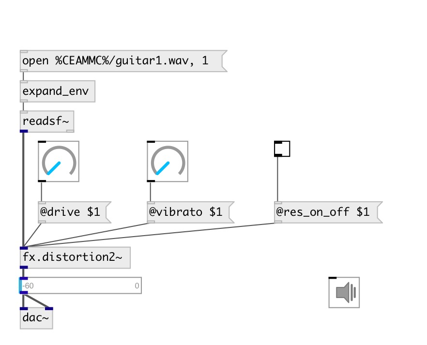

[index](index.html) :: [fx](category_fx.html)
---

# fx.distortion2~

###### distortion #2 from Guitarix effects set

*available since version:* 0.7

---

## properties:

* **@sp_low_freq** 
Get/set speaker emulation low frequency 
_type:_ float 
_units:_ Hz 
_range:_ 20..1000 
_default:_ 130 

* **@sp_high_freq** 
Get/set speaker emulation high frequency 
_type:_ float 
_units:_ Hz 
_range:_ 1000..12000 
_default:_ 5000 

* **@sp_on_off** 
Get/set speaker emulation turn on/off 
_type:_ bool 
_default:_ 0 

* **@lp_freq** 
Get/set low pass frequency 
_type:_ float 
_units:_ Hz 
_range:_ 20..12000 
_default:_ 5000 

* **@hp_freq** 
Get/set high pass frequency 
_type:_ float 
_units:_ Hz 
_range:_ 20..7040 
_default:_ 130 

* **@flt_on_off** 
Get/set filter processing 
_type:_ bool 
_default:_ 0 

* **@level** 
Get/set effect level 
_type:_ float 
_range:_ 0..0.5 
_default:_ 0.01 

* **@gain** 
Get/set total effect gain 
_type:_ float 
_units:_ db 
_range:_ -10..10 
_default:_ 2 

* **@drive** 
Get/set distortion amount 
_type:_ float 
_range:_ 0..1 
_default:_ 0.64 

* **@res_on_off** 
Get/set resonator 
_type:_ bool 
_default:_ 0 

* **@vibrato** 
Get/set resonator vibration 
_type:_ float 
_range:_ 0..1 
_default:_ 1 

* **@trigger** 
Get/set resonator trigger 
_type:_ float 
_range:_ 0..1 
_default:_ 0.12 

* **@active** 
Get/set on/off dsp processing 
_type:_ bool 
_default:_ 1 

## inlets:

* input signal 
_type:_ audio

## outlets:

* output signal 
_type:_ audio

## keywords:

[fx](keywords/fx.html)
[distortion](keywords/distortion.html)

**See also:**
[\[fx.distortion~\]](fx.distortion~.html)
[\[fx.distortion1~\]](fx.distortion1~.html)
[\[fx.distortion3~\]](fx.distortion3~.html)

**Authors:** Serge Poltavsky

**License:** GPL3 or later

