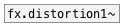

[<<< reference home](ceammc_lib.md)
---

# fx.distortion2~

```


[open %CEAMMC%/guitar1.wav, 1(
|
[expand_env]
|
[readsf~]
|
| [ui.knob]   [ui.knob]     [T]
| |           |             |
| |           |             |
| |           |             |
| [@drive $1( [@vibrato $1( [@res_on_off $1(
| |           |             |
| |           |             |
[fx.distortion2~            ]
|
[ui.gain~ @size 120 16]           [ui.dsp~]
|\
[dac~]

            
```
---
distortion #2 from Guitarix effects set
---
arguments:


---
properties:

@sp_low_freq(Hz): speaker emulation low frequency<br>
@sp_high_freq(Hz): speaker emulation high frequency<br>
@sp_on_off: speaker emulation turn
            on/off<br>
@lp_freq(Hz): low pass frequency<br>
@hp_freq(Hz): high pass frequency<br>
@flt_on_off: filter
            processing<br>
@level: effect
            level<br>
@gain(db): total effect gain<br>
@drive: 
            distortion amount<br>
@res_on_off: resonator<br>
@vibrato: resonator
            vibration<br>
@trigger: 
            resonator trigger<br>
@active: on/off dsp
            processing<br>

---
see also:<br>
[](fx.distortion~.md)
[](fx.distortion1~.md)
[](fx.distortion3~.md)
