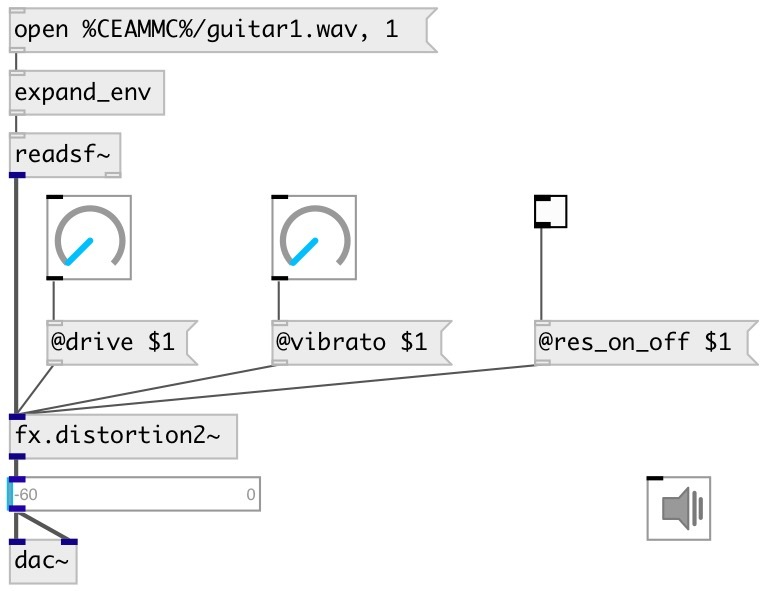

[index](index.html) :: [fx](category_fx.html)
---

# fx.distortion2~

###### distortion #2 from Guitarix effects set

*available since version:* 0.7

---

## properties:

* **@sp_low_freq** 
Get/set speaker emulation low frequency 
__type:__ float 
__units:__ Hz 
__range:__ 20..1000 
__default:__ 130 

* **@sp_high_freq** 
Get/set speaker emulation high frequency 
__type:__ float 
__units:__ Hz 
__range:__ 1000..12000 
__default:__ 5000 

* **@sp_on_off** 
Get/set speaker emulation turn on/off 
__type:__ int 
__enum:__ 0, 1 
__default:__ 0 

* **@lp_freq** 
Get/set low pass frequency 
__type:__ float 
__units:__ Hz 
__range:__ 20..12000 
__default:__ 5000 

* **@hp_freq** 
Get/set high pass frequency 
__type:__ float 
__units:__ Hz 
__range:__ 20..7040 
__default:__ 130 

* **@flt_on_off** 
Get/set filter processing 
__type:__ int 
__enum:__ 0, 1 
__default:__ 0 

* **@level** 
Get/set effect level 
__type:__ float 
__range:__ 0..0.5 
__default:__ 0.01 

* **@gain** 
Get/set total effect gain 
__type:__ float 
__units:__ db 
__range:__ -10..10 
__default:__ 2 

* **@drive** 
Get/set distortion amount 
__type:__ float 
__range:__ 0..1 
__default:__ 0.64 

* **@res_on_off** 
Get/set resonator 
__type:__ int 
__enum:__ 0, 1 
__default:__ 0 

* **@vibrato** 
Get/set resonator vibration 
__type:__ float 
__range:__ 0..1 
__default:__ 1 

* **@trigger** 
Get/set resonator trigger 
__type:__ float 
__range:__ 0..1 
__default:__ 0.12 

* **@active** 
Get/set on/off dsp processing 
__type:__ int 
__enum:__ 0, 1 
__default:__ 1 

## inlets:

* input signal 
__type:__ audio 

## outlets:

* output signal
__type:__ audio 

## keywords:

[fx](keywords/fx.html)
[distortion](keywords/distortion.html)

**See also:**
[\[fx.distortion~\]](fx.distortion~.html)
[\[fx.distortion1~\]](fx.distortion1~.html)
[\[fx.distortion3~\]](fx.distortion3~.html)

**Authors:** Serge Poltavsky

**License:** GPL3 or later

