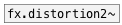

# fx.distortion3~

```


[open %CEAMMC%/guitar1.wav, 1(
|
[expand_env]
|
[readsf~]
|
| [ui.knob]   [ui.knob]    [ui.knob]    [T]
| |           |            |            |
| |           |            |            |
| |           |            |            |
| [@drive $1( [@offset $1( [@drywet $1( [@bypass $1(
| |           |            |            |
| |           |            |            |
[fx.distortion2~                        ]
|
[ui.gain~ @size 120 16]           [ui.dsp~]
|\
[dac~]

            
```
---
arguments:


---
properties:

@gain(db): total effect gain<br>
@drive: distortion
            amount<br>
@lp_freq(Hz): low pass frequency<br>
@hp_freq(Hz): high pass frequency<br>
@active: on/off dsp
            processing<br>
@drywet: proportion
            of mix between the original (dry) and &#39;effected&#39; (wet) signals. 0 - dry signal, 1 -
            wet.<br>
@bypass: if set to 1 - bypass
            &#39;effected&#39; signal.<br>

see also:<br>



