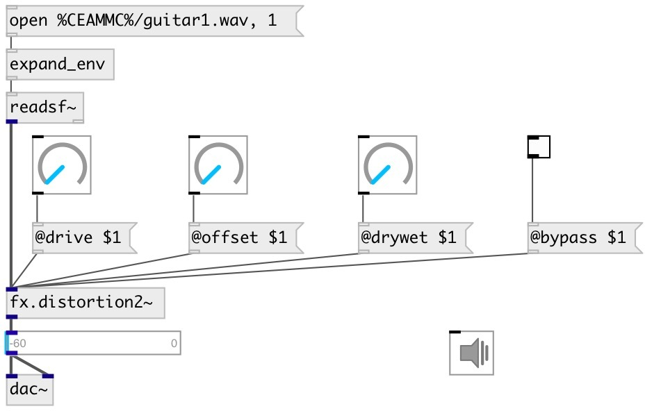

[index](index.html) :: [fx](category_fx.html)
---

# fx.distortion3~

###### simple distortion #3 from Guitarix effects set

*available since version:* 0.7

---

## properties:

* **@gain** 
Get/set total effect gain 
_type:_ float 
_units:_ db 
_range:_ -30..10 
_default:_ 0 

* **@drive** 
Get/set distortion amount 
_type:_ float 
_range:_ 0..1 
_default:_ 0.5 

* **@lp_freq** 
Get/set low pass frequency 
_type:_ float 
_units:_ Hz 
_range:_ 1000..20000 
_default:_ 10000 

* **@hp_freq** 
Get/set high pass frequency 
_type:_ float 
_units:_ Hz 
_range:_ 20..2000 
_default:_ 30 

* **@active** 
Get/set on/off dsp processing 
_type:_ int 
_enum:_ 0, 1 
_default:_ 1 

* **@drywet** 
Get/set proportion of mix between the original (dry) and &#39;effected&#39; (wet) signals. 0 -
dry signal, 1 - wet. 
_type:_ float 
_range:_ 0..1 
_default:_ 1 

* **@bypass** 
Get/set if set to 1 - bypass &#39;effected&#39; signal. 
_type:_ int 
_enum:_ 0, 1 
_default:_ 0 

## inlets:

* input signal 
_type:_ audio

## outlets:

* output signal 
_type:_ audio

## keywords:

[fx](keywords/fx.html)
[distortion](keywords/distortion.html)

**See also:**
[\[fx.distortion~\]](fx.distortion~.html)
[\[fx.distortion1~\]](fx.distortion1~.html)
[\[fx.distortion2~\]](fx.distortion2~.html)

**Authors:** Serge Poltavsky

**License:** GPL3 or later

