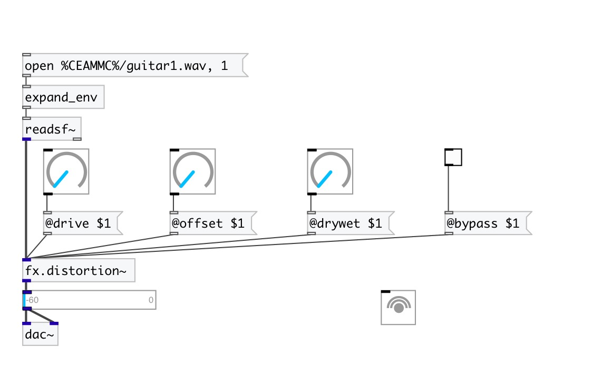

[< reference home](index.html)
---

# fx.distortion~

cubic nonlinearity distortion

---

 

---

---
arguments:

drive: distortion
            amount 
offset: constant added before
            nonlinearity to give even harmonics 

---
properties:

@drive: distortion
            amount 
@drywet: proportion
            of mix between the original (dry) and &#39;effected&#39; (wet) signals. 0 - dry signal, 1 -
            wet. 
@offset: constant
            added before nonlinearity to give even harmonics 
@bypass: if set to 1 - bypass
            &#39;effected&#39; signal. 
@active: on/off dsp
            processing 

