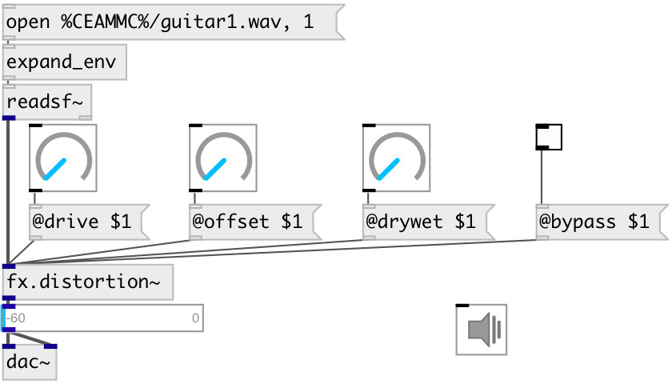

[index](index.html) :: [fx](category_fx.html)
---

# fx.distortion~

###### cubic nonlinearity distortion

*available since version:* 0.2

---

## arguments:

* **drive**
distortion amount 
_type:_ float 

* **offset**
constant added before nonlinearity to give even harmonics 
_type:_ float 

## properties:

* **@drive** 
Get/set distortion amount 
_type:_ float 
_range:_ 0..1 
_default:_ 0.5 

* **@drywet** 
Get/set proportion of mix between the original (dry) and &#39;effected&#39; (wet) signals. 0 -
dry signal, 1 - wet. 
_type:_ float 
_range:_ 0..1 
_default:_ 1 

* **@offset** 
Get/set constant added before nonlinearity to give even harmonics 
_type:_ float 
_range:_ 0..0.5 
_default:_ 0 

* **@bypass** 
Get/set if set to 1 - bypass &#39;effected&#39; signal. 
_type:_ int 
_enum:_ 0, 1 
_default:_ 0 

* **@active** 
Get/set on/off dsp processing 
_type:_ int 
_enum:_ 0, 1 
_default:_ 1 

## inlets:

* input signal 
_type:_ audio

## outlets:

* output signal 
_type:_ audio

## keywords:

[fx](keywords/fx.html)
[distortion](keywords/distortion.html)

**Authors:** Serge Poltavsky

**License:** GPL3 or later

