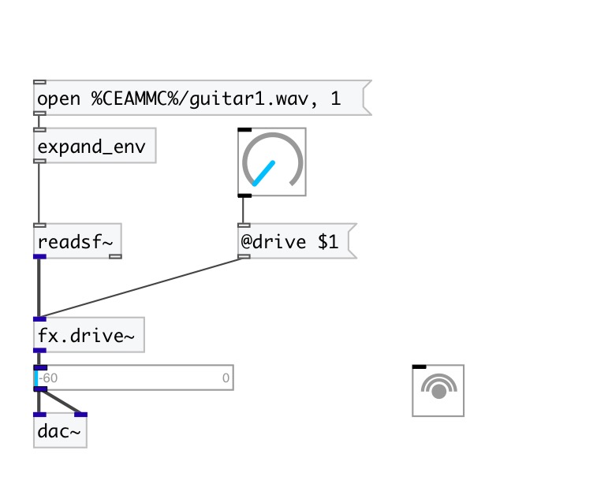

[< reference home](index.html)
---

# fx.drive~

Guitarix drive effect

---

 

---

---
arguments:

DRIVE: drive
            coefficient 

---
properties:

@drive: drive
            coefficient 
@bypass: if set to 1 - bypass
            &#39;effected&#39; signal. 
@active: on/off dsp
            processing 

