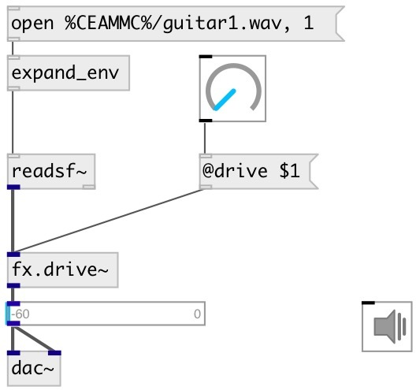

[index](index.html) :: [fx](category_fx.html)
---

# fx.drive~

###### Guitarix drive effect

*available since version:* 0.7

---

## arguments:

* **DRIVE**
drive coefficient 
_type:_ float 

## properties:

* **@drive** 
Get/set drive coefficient 
_type:_ float 
_range:_ 1..10 
_default:_ 1 

* **@bypass** 
Get/set if set to 1 - bypass &#39;effected&#39; signal. 
_type:_ int 
_enum:_ 0, 1 
_default:_ 0 

* **@active** 
Get/set on/off dsp processing 
_type:_ int 
_enum:_ 0, 1 
_default:_ 1 

## inlets:

* input signal 
_type:_ audio

## outlets:

* output 
_type:_ audio

## keywords:

[fx](keywords/fx.html)
[drive](keywords/drive.html)

**Authors:** Serge Poltavsky

**License:** GPL3 or later

