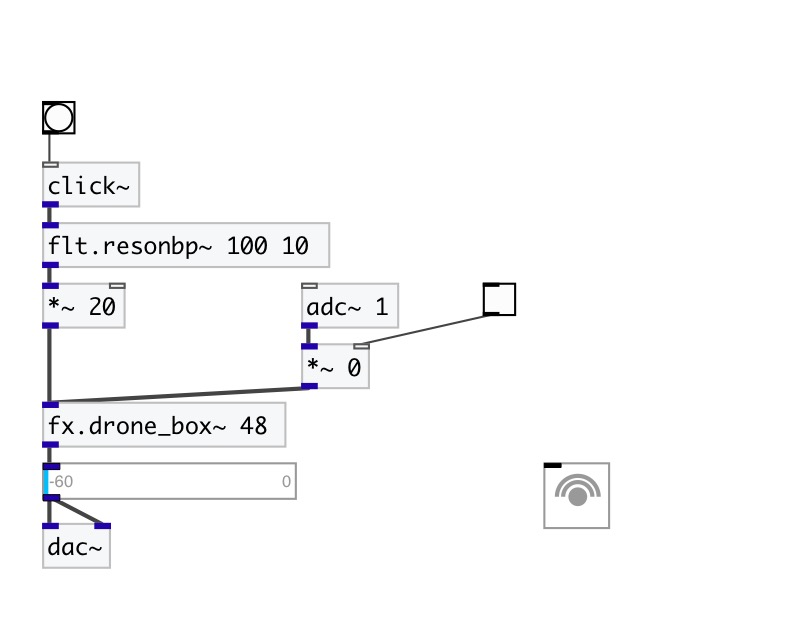

[< reference home](index.html)
---

# fx.drone_box~

mono sympathetic resonance generator

---

 

---

---
arguments:

pitch: drone MIDI
            pitch 

---
properties:

@pitch: drone
            MIDI pitch 
@decay(ms): drone pluck decay time 
@drywet: 
            proportion of mix between the original (dry) and &#39;effected&#39; (wet) signals. 0 - dry
            signal, 1 - wet. 
@bypass: if set to 1 - bypass
            &#39;effected&#39; signal. 
@active: on/off dsp
            processing 

