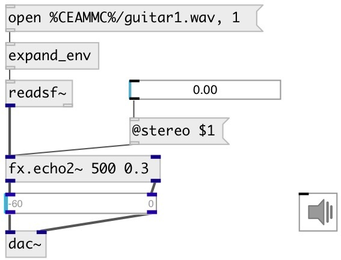

[index](index.html) :: [fx](category_fx.html)
---

# fx.echo2~

###### stereo echo effect

*available since version:* 0.9.4

---

## arguments:

* **time**
echo time 
_type:_ float 
_units:_ ms 

* **feedback**
feedback coefficient 
_type:_ float 

## methods:

* **reset**
reset to initial state 

## properties:

* **@delay** 
Get/set echo time 
_type:_ float 
_units:_ ms 
_range:_ 10..5000 
_default:_ 500 

* **@feedback** 
Get/set feedback coefficient 
_type:_ float 
_range:_ 0..0.99 
_default:_ 0.3 

* **@stereo** 
Get/set The stereo parameter controls the amount of stereo spread. For stereo=0 you get
a plain delay, without crosstalk between the channels. For stereo=1 you get a
pure ping-pong delay where the echos from the left first appear on the right
channel and vice versa 
_type:_ float 
_range:_ 0..1 
_default:_ 1 

* **@drywet** 
Get/set proportion of mix between the original (dry) and &#39;effected&#39; (wet) signals. 0 -
dry signal, 1 - wet 
_type:_ float 
_range:_ 0..1 
_default:_ 1 

* **@bypass** 
Get/set if set to 1 - bypass &#39;effected&#39; signal 
_type:_ int 
_enum:_ 0, 1 
_default:_ 0 

* **@active** 
Get/set on/off dsp processing 
_type:_ int 
_enum:_ 0, 1 
_default:_ 1 

## inlets:

* left input signal 
_type:_ audio
* right input signal 
_type:_ audio

## outlets:

* left output signal 
_type:_ audio
* right output signal 
_type:_ audio

## keywords:

[fx](keywords/fx.html)
[echo](keywords/echo.html)
[stereo](keywords/stereo.html)
[delay](keywords/delay.html)

**See also:**
[\[fx.echo2~\]](fx.echo2~.html)
[\[fx.sdelay~\]](fx.sdelay~.html)

**Authors:** Serge Poltavsky

**License:** GPL3 or later

