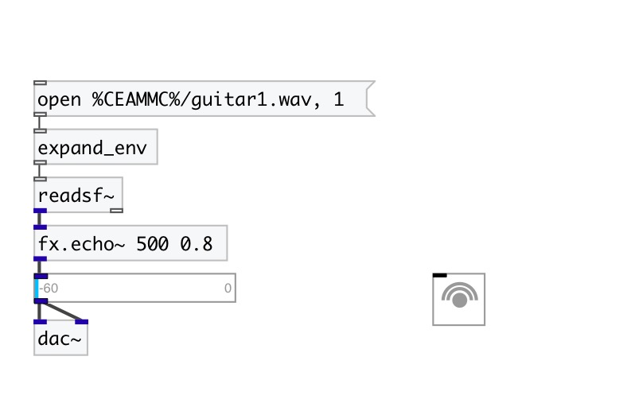
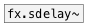

[< reference home](index.html)
---

# fx.echo~

simple echo effect

---

 

---

---
arguments:

time(ms): 
            echo time 
feedback: feedback
            coefficient 

---
properties:

@delay(ms): echo time 
@feedback: 
            feedback coefficient 
@drywet: proportion
            of mix between the original (dry) and &#39;effected&#39; (wet) signals. 0 - dry signal, 1 -
            wet 
@bypass: if set to 1 - bypass
            &#39;effected&#39; signal 
@active: on/off dsp
            processing 

---
see also: 

