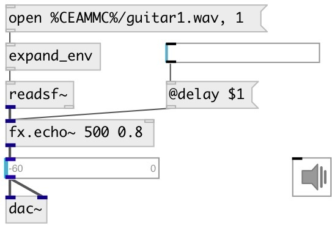

[index](index.html) :: [fx](category_fx.html)
---

# fx.echo~

###### simple echo effect

*available since version:* 0.6

---

## arguments:

* **DELAY**
echo time 
_type:_ float 
_units:_ ms 

* **FEEDBACK**
feedback coefficient 
_type:_ float 

## methods:

* **reset**
reset to initial state 

## properties:

* **@delay** 
Get/set echo time 
_type:_ float 
_units:_ ms 
_range:_ 10..10000 
_default:_ 500 

* **@feedback** 
Get/set feedback coefficient 
_type:_ float 
_range:_ 0..0.99 
_default:_ 0.3 

* **@drywet** 
Get/set proportion of mix between the original (dry) and &#39;effected&#39; (wet) signals. 0 -
dry signal, 1 - wet 
_type:_ float 
_range:_ 0..1 
_default:_ 1 

* **@bypass** 
Get/set if set to 1 - bypass &#39;effected&#39; signal 
_type:_ bool 
_default:_ 0 

* **@active** 
Get/set on/off dsp processing 
_type:_ bool 
_default:_ 1 

## inlets:

* input signal 
_type:_ audio

## outlets:

* output signal 
_type:_ audio

## keywords:

[fx](keywords/fx.html)
[echo](keywords/echo.html)
[delay](keywords/delay.html)

**See also:**
[\[fx.sdelay~\]](fx.sdelay~.html)

**Authors:** Serge Poltavsky

**License:** GPL3 or later

