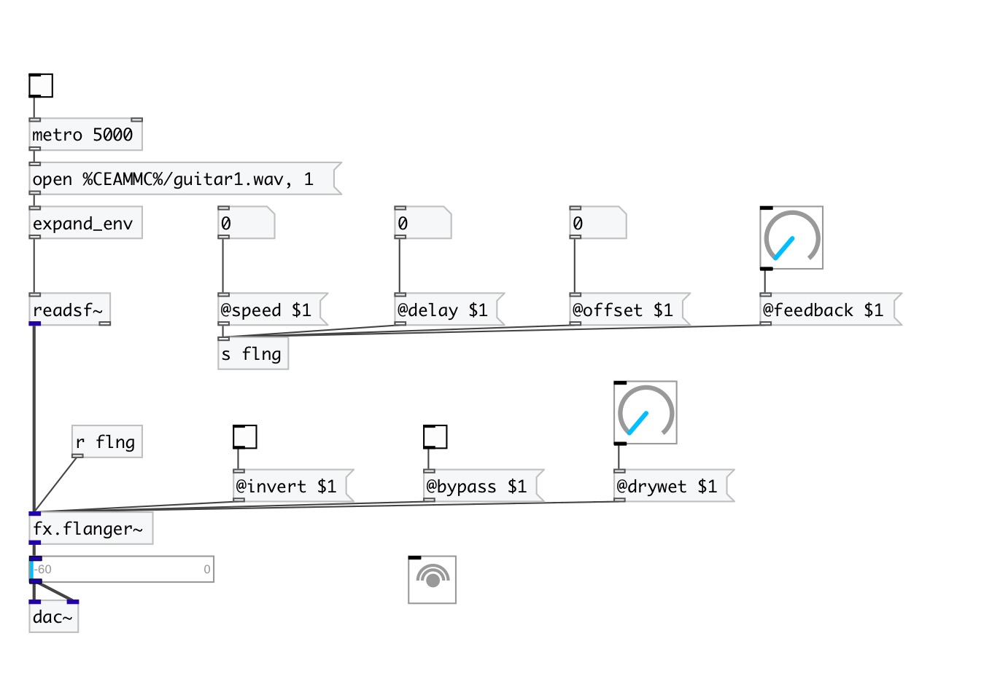

[< reference home](index.html)
---

# fx.flanger~

mono flanging effect

---

 

---

---
arguments:

---
properties:

@delay(ms): flange delay 
@offset(ms): flange delay offset 
@speed(Hz): flanger frequency 
@feedback: feedback
            gain 
@invert: 0 for normal, 1 to invert
            sign of flanging sum 
@drywet: proportion
            of mix between the original (dry) and &#39;effected&#39; (wet) signals. 0 - dry signal, 1 -
            wet. 
@bypass: if set to 1 - bypass
            &#39;effected&#39; signal. 
@active: on/off dsp
            processing 

