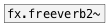

[< reference home](index.html)
---

# fx.freeverb~


freeverb - common used open-source reverb

---

A simple Schroeder reverberator primarily developed by &#34;Jezar at Dreampoint&#34; that
            is extensively used in the free-software world. It uses four Schroeder allpasses in
            series and eight parallel Schroeder-Moorer filtered-feedback comb-filters for each
            audio channel, and is said to be especially well tuned.
<br>


---


```


[F]                [open %CEAMMC%/guitar1.wav, 1(
|                  |
[lfo.impulse~ 2]   [expand_env #a]
|
|  [T]             [ui.knob]  [ui.knob]  [ui.knob]
|  |.              |          |          |
[*~ ] [readsf~ #b] |          |          |
|     |            |          |          |
|     |            [@room $1( [@damp $1( [@drywet $1(
|     |            |          |          |
|     |            |          |          |
|     |            |          |          |
[fx.freeverb~  0.95    0.125             ]
|
[ui.gain~ @size 120 16] [ui.dsp~]
| \
[dac~]

[X a->b]

            
```

---
arguments:

ROOM: room size<br>
DRYWET: ratio between processed
            signal (wet) and source signal<br>

---
properties:

@room: room
            size<br>
@damp: damping of
            the lowpass comb filter<br>
@drywet: 
            proportion of mix between the original (dry) and &#39;effected&#39; (wet) signals. 0 - dry
            signal, 1 - wet<br>
@bypass: if set to 1 - bypass
            &#39;effected&#39; signal<br>
@active: on/off dsp
            processing<br>

---
see also:<br>
[](fx.freeverb2~.html)
