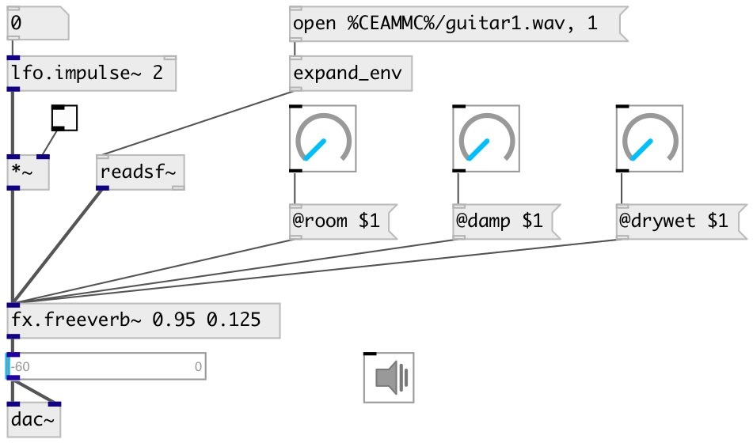

[index](index.html) :: [fx](category_fx.html)
---

# fx.freeverb~

###### freeverb - common used open-source reverb

*available since version:* 0.2

---

## information
A simple Schroeder reverberator primarily developed by &#34;Jezar at Dreampoint&#34; that
            is extensively used in the free-software world. It uses four Schroeder allpasses in
            series and eight parallel Schroeder-Moorer filtered-feedback comb-filters for each
            audio channel, and is said to be especially well tuned.

## arguments:

* **ROOM**
room size 
__type:__ float 

* **DRYWET**
proportion of mix between the original (dry) and &#39;effected&#39; (wet) signals 
__type:__ float 

## methods:

* **reset**
reset reverb 

## properties:

* **@room** 
Get/set room size 
__type:__ float 
__range:__ 0..1 
__default:__ 0.5 

* **@damp** 
Get/set damping of the lowpass comb filter 
__type:__ float 
__range:__ 0..1 
__default:__ 0.5 

* **@drywet** 
Get/set proportion of mix between the original (dry) and &#39;effected&#39; (wet) signals. 0 -
dry signal, 1 - wet 
__type:__ float 
__range:__ 0..1 
__default:__ 0.33 

* **@bypass** 
Get/set if set to 1 - bypass &#39;effected&#39; signal 
__type:__ int 
__enum:__ 0, 1 
__default:__ 0 

* **@active** 
Get/set on/off dsp processing 
__type:__ int 
__enum:__ 0, 1 
__default:__ 1 

* **@freeze** 
Get/set freeze reverberation tail 
__type:__ int 
__enum:__ 0, 1 
__default:__ 0 

* **@fr_room** 
Get/set freeze room size 
__type:__ float 
__range:__ 0..1 
__default:__ 0.999 

* **@fr_damp** 
Get/set freeze room damp 
__type:__ float 
__range:__ 0..1 
__default:__ 0.0001 

* **@fr_time** 
Get/set length of freeze tail 
__type:__ float 
__units:__ ms 
__range:__ 0..1000 
__default:__ 100 

## inlets:

* input signal 
__type:__ audio 

## outlets:

* output signal
__type:__ audio 

## keywords:

[fx](keywords/fx.html)
[reverb](keywords/reverb.html)

**See also:**
[\[fx.freeverb2~\]](fx.freeverb2~.html)

**Authors:** Serge Poltavsky

**License:** GPL3 or later

