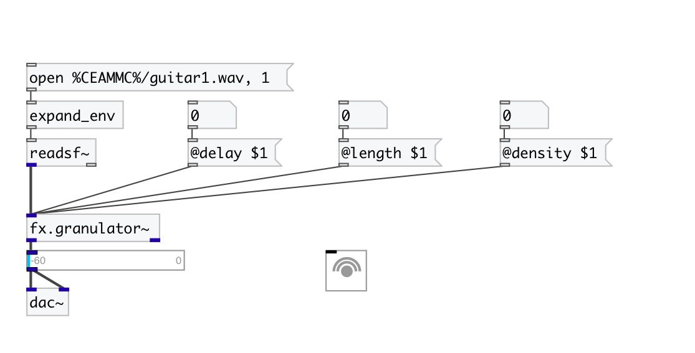

[< reference home](index.html)
---

# fx.granulator~

simple input stream granulator

---

 

---

---
arguments:

---
properties:

@density: number of
            grains 
@length(ms): grain length 
@delay(sec): grain total area length 
@active: on/off dsp
            processing 

