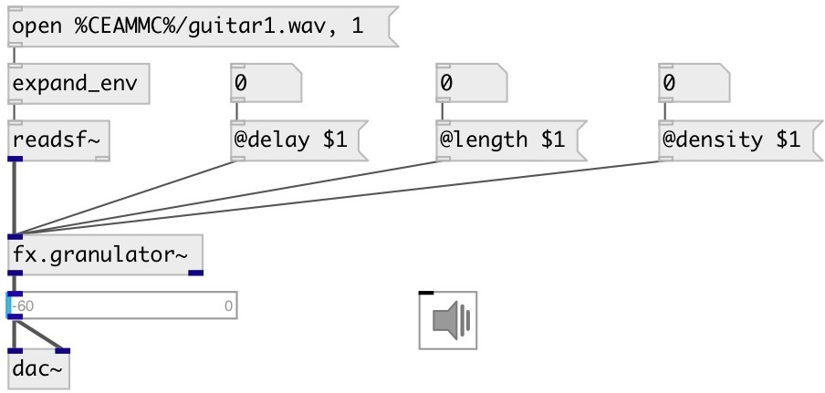

[index](index.html) :: [fx](category_fx.html)
---

# fx.granulator~

###### simple input stream granulator

*available since version:* 0.7

---

## methods:

* **reset**
reset object state 

## properties:

* **@density** 
Get/set number of grains 
__type:__ int 
__range:__ 1..64 
__default:__ 10 

* **@length** 
Get/set grain length 
__type:__ float 
__units:__ ms 
__range:__ 10..500 
__default:__ 100 

* **@delay** 
Get/set grain total area length 
__type:__ float 
__units:__ sec 
__range:__ 0.5..10 
__default:__ 10 

* **@active** 
Get/set on/off dsp processing 
__type:__ int 
__enum:__ 0, 1 
__default:__ 1 

## inlets:

* left channel 
__type:__ audio 

## outlets:

* output
__type:__ audio 
* output
__type:__ audio 

## keywords:

[fx](keywords/fx.html)
[bits](keywords/bits.html)
[granulator](keywords/granulator.html)

**Authors:** Mayank Sanganeria, Serge Poltavsky

**License:** GPL3 or later

