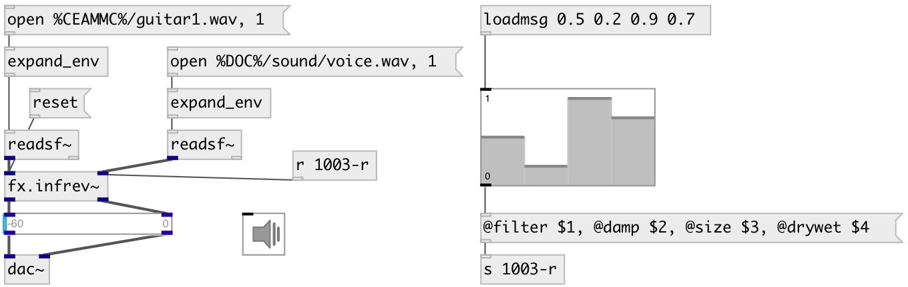

[index](index.html) :: [fx](category_fx.html)
---

# fx.infrev~

###### port of Infinity VST plugin from airwindows

*available since version:* 0.9.3

---

## information
Infinity is a MatrixVerb specifically designed to sustain and layer sounds
            forever.

## arguments:

* **SIZE**
room size 
__type:__ float 

* **DRYWET**
proportion of mix between the original (dry) and &#39;effected&#39; (wet) signals 
__type:__ float 

## methods:

* **reset**
reset reverb 

## properties:

* **@size** 
Get/set room size 
__type:__ float 
__range:__ 0..1 
__default:__ 0.5 

* **@filter** 
Get/set filter coefficient 
__type:__ float 
__range:__ 0..1 
__default:__ 1 

* **@damp** 
Get/set damping of the lowpass comb filter 
__type:__ float 
__range:__ 0..1 
__default:__ 0 

* **@drywet** 
Get/set proportion of mix between the original (dry) and &#39;effected&#39; (wet) signals. 0 -
dry signal, 1 - wet 
__type:__ float 
__range:__ 0..1 
__default:__ 1 

* **@bypass** 
Get/set if set to 1 - bypass &#39;effected&#39; signal 
__type:__ int 
__enum:__ 0, 1 
__default:__ 0 

## inlets:

* input Left signal 
__type:__ audio 
* input Right signal 
__type:__ audio 

## outlets:

* output Left signal
__type:__ audio 
* output Right signal
__type:__ audio 

## keywords:

[fx](keywords/fx.html)
[reverb](keywords/reverb.html)
[airwindows](keywords/airwindows.html)
[infinity](keywords/infinity.html)

**See also:**
[\[fx.freeverb~\]](fx.freeverb~.html)
[\[fx.zita_rev1~\]](fx.zita_rev1~.html)

**Authors:** Serge Poltavsky

**License:** GPL3 or later

