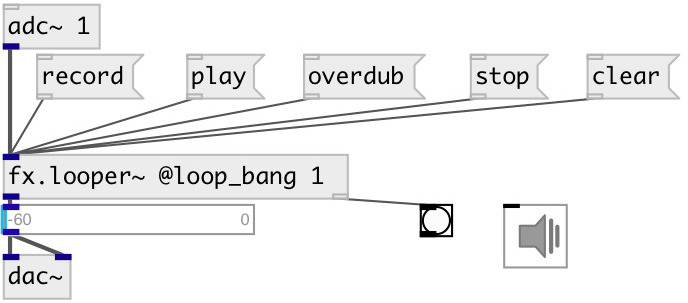

[index](index.html) :: [fx](category_fx.html)
---

# fx.looper~

###### One track looper

*available since version:* 0.5

---

## arguments:

* **CAPACITY**
max loop time 
_type:_ float 
_units:_ sec 

## methods:

* **adjust**
increase loop length 
  __parameters:__
  - **[DELTA]** loop length delta 
    type: float  
    units: samp  

* **clear**
clear loop data and stops playing 

* **overdub**
start loop overdubbing while keeping it playing 

* **pause**
loop pause 

* **play**
play recorded or stopped loop 

* **rec**
same as record 

* **record**
start loop record 

* **smooth**
 
  __parameters:__
  - **[TIME]** apply linear fadein/fadeout to loop 
    type: float  
    units: ms  

* **stop**
stop played loop 

## properties:

* **@capacity** 
Get/set max loop time 
_type:_ float 
_units:_ sec 
_range:_ 0..120 
_default:_ 5 

* **@length** (readonly)
Get recorded loop length 
_type:_ float 
_units:_ sec 
_min value:_ 0 
_default:_ 0 

* **@array** 
Get/set use specified array for record instead of internal buffer 
_type:_ symbol 

* **@play_pos** (readonly)
Get current playing position 
_type:_ float 
_units:_ sec 
_min value:_ 0 
_default:_ 0 

* **@play_phase** (readonly)
Get current playing phase position 
_type:_ float 
_range:_ 0..1 
_default:_ 0 

* **@state** (readonly)
Get current state 
_type:_ symbol 
_enum:_ init, stop, record, play, overdub 
_default:_ init 

* **@loop_bang** 
Get/set output bang on each loop start 
_type:_ bool 
_default:_ 1 

* **@loop_smooth** 
Get/set time of lin fadein/fadeout applied to recorded loop for smooth playing 
_type:_ float 
_units:_ ms 
_min value:_ 0 
_default:_ 10 

* **@play_to_stop_time** 
Get/set fadeout time while transition from play to stop 
_type:_ float 
_units:_ ms 
_min value:_ 0 
_default:_ 10 

* **@play_to_dub_time** 
Get/set fadein time of overdub input signal while transition from play mode 
_type:_ float 
_units:_ ms 
_min value:_ 0 
_default:_ 10 

* **@rec_to_play_time** 
Get/set xfade between recorded and input signal while transition from record to play 
_type:_ float 
_units:_ ms 
_min value:_ 0 
_default:_ 30 

* **@dub_to_stop_time** 
Get/set fadeout time while transition from overdub to stop 
_type:_ float 
_units:_ ms 
_min value:_ 0 
_default:_ 20 

* **@dub_to_play_time** 
Get/set record fadeout time while transition from overdub to play 
_type:_ float 
_units:_ ms 
_min value:_ 0 
_default:_ 20 

* **@stop_to_play_time** 
Get/set fadein time of play while transition from stop 
_type:_ float 
_units:_ ms 
_min value:_ 0 
_default:_ 10 

* **@round** 
Get/set encrease loop length to be multiple of specified value. If *0* - no rounding is
performed 
_type:_ int 
_units:_ samp 
_min value:_ 0 
_default:_ 0 

## inlets:

* input signal 
_type:_ audio

## outlets:

* output signal 
_type:_ audio
* bang on each loop start if @loop_bang property is true 
_type:_ control

## keywords:

[fx](keywords/fx.html)
[looper](keywords/looper.html)

**Authors:** Serge Poltavsky

**License:** GPL3 or later

