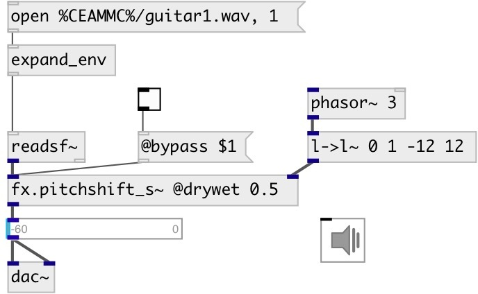

[index](index.html) :: [fx](category_fx.html)
---

# fx.pitchshift_s~

###### signal version of fx.pitchshift~

*available since version:* 0.9

---

## methods:

* **reset**
reset object state 

## properties:

* **@window** 
Get/set the window size 
__type:__ float 
__units:__ ms 
__range:__ 10..2000 
__default:__ 200 

* **@fade** 
Get/set crossfade duration 
__type:__ float 
__units:__ ms 
__range:__ 0..1000 
__default:__ 100 

* **@drywet** 
Get/set proportion of mix between the original (dry) and &#39;effected&#39; (wet) signals. 0 -
dry signal, 1 - wet. 
__type:__ float 
__range:__ 0..1 
__default:__ 1 

* **@bypass** 
Get/set if set to 1 - bypass &#39;effected&#39; signal. 
__type:__ int 
__enum:__ 0, 1 
__default:__ 0 

* **@active** 
Get/set on/off dsp processing 
__type:__ int 
__enum:__ 0, 1 
__default:__ 1 

## inlets:

* input signal 
__type:__ audio 
* pitch shift in semitones 
__type:__ audio 

## outlets:

* output signal
__type:__ audio 

## keywords:

[fx](keywords/fx.html)
[pitchshift](keywords/pitchshift.html)

**Authors:** Alex Nadzharov, Serge Poltavsky

**License:** GPL3 or later

