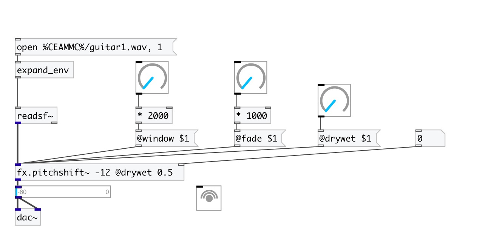

[< reference home](index.html)
---

# fx.pitchshift~

simple pitch shifter based on 2 delay lines

---

 

---

---
arguments:

PITCH: pitch shift in
            semitones 

---
properties:

@pitch: 
            pitchshift in semitones 
@window(ms): the window size 
@fade(ms): crossfade duration 
@drywet: proportion
            of mix between the original (dry) and &#39;effected&#39; (wet) signals. 0 - dry signal, 1 -
            wet. 
@bypass: if set to 1 - bypass
            &#39;effected&#39; signal. 
@active: on/off dsp
            processing 

