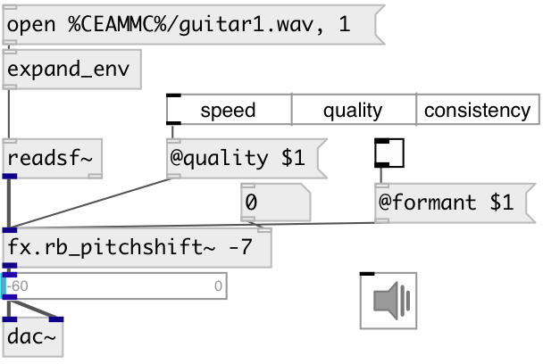

[index](index.html) :: [fx](category_fx.html)
---

# fx.rb_pitchshift~

###### rubber band pitchshift

*available since version:* 0.9.4

---

## arguments:

* **TRANSPOSE**
transposition in semitones 
_type:_ float 
_units:_ semitone 

## properties:

* **@window** 
Get/set the window size. &#39;standard&#39; is expected to produce better results than the
other window options in most situations. &#39;short&#39; may result in crisper sound
for audio that depends strongly on its timing qualities. &#39;long&#39; is likely to
result in a smoother sound at the expense of clarity and timing 
_type:_ symbol 
_enum:_ standard, short, long 
_default:_ standard 

* **@quality** 
Get/set method used for pitch shifting. &#39;speed&#39; may sound less clear than &#39;quality&#39;,
especially for large pitch shifts. &#39;quality&#39; method has a CPU cost
approximately proportional to the required frequency shift. &#39;consistency&#39; gives
greatest consistency when used to create small variations in pitch around the
1.0-ratio level. Unlike the previous two options, this avoids discontinuities
when moving across the 1.0 pitch scale in real-time; it also consumes more CPU
than the others in the case where the pitch scale is exactly 1.0. 
_type:_ symbol 
_enum:_ speed, quality, consistency 
_default:_ speed 

* **@transpose** 
Get/set transposition in semitones 
_type:_ float 
_units:_ semitone 
_range:_ -24..24 
_default:_ 0 

* **@phase** 
Get/set control the adjustment of component frequency phases from one analysis window
to the next during non-transient segments. &#39;False&#39; adjust the phase in each
frequency bin independently from its neighbours. This usually results in a
slightly softer, phasier sound. &#39;True&#39; adjust phases when stretching in such a
way as to try to retain the continuity of phase relationships between adjacent
frequency bins whose phases are behaving in similar ways 
_type:_ bool 
_default:_ 1 

* **@smooth** 
Get/set control the use of window-presum FFT and time-domain smoothing. If true result
in a softer sound with some audible artifacts around sharp transients, but it
may be appropriate for longer stretches of some instruments and can mix well
with @window short 
_type:_ bool 
_default:_ 0 

* **@scale** 
Get/set transposition as ratio 
_type:_ float 
_range:_ 0.25..4 
_default:_ 1 

* **@formant** 
Get/set control the handling of formant shape (spectral envelope) when pitch-shifting.
If &#39;true&#39; preserve the spectral envelope of the unshifted signal. This permits
shifting the note frequency without so substantially affecting the perceived
pitch profile of the voice or instrument. &#39;False&#39; apply no special formant
processing. The spectral envelope will be pitch shifted as normal. 
_type:_ bool 
_default:_ 0 

* **@latency** (readonly)
Get object latency 
_type:_ float 
_units:_ samp 
_default:_ 1024 

* **@trans** 
Get/set control the component frequency phase-reset mechanism that may be used at
transient points to provide clarity and realism to percussion and other
significant transient sounds. &#39;crisp&#39; reset component phases at the peak of
each transient (the start of a significant note or percussive event). This
usually results in a clear-sounding output; but it is not always consistent,
and may cause interruptions in stable sounds present at the same time as
transient events. The @detector property can be used to tune this to some
extent. &#39;mixed&#39; reset component phases at the peak of each transient, outside a
frequency range typical of musical fundamental frequencies. The results may be
more regular for mixed stable and percussive notes than &#39;crisp&#39;, but with a
&#34;phasier&#34; sound. The balance may sound very good for certain types of music and
fairly bad for others. &#39;smooth&#39; do not reset component phases at any point. The
results will be smoother and more regular but may be less clear than with
either of the other @trans settings 
_type:_ symbol 
_enum:_ crisp, mixed, smooth 
_default:_ crisp 

* **@detector** 
Get/set control the type of transient detector used. &#39;compound&#39; a general-purpose
transient detector which is likely to be good for most situations. &#39;precussive&#39;
detect percussive transients. &#39;piano&#39; use an onset detector with less of a bias
toward percussive transients. This may give better results with certain
material (e.g. relatively monophonic piano music). 
_type:_ symbol 
_enum:_ compound, percussive, soft 
_default:_ compound 

## inlets:

* input signal 
_type:_ audio
* pitch shift in semitones 
_type:_ control

## outlets:

* output signal 
_type:_ audio

## keywords:

[fx](keywords/fx.html)
[pitchshift](keywords/pitchshift.html)
[rubberband](keywords/rubberband.html)

**Authors:** Serge Poltavsky

**License:** GPL3 or later

