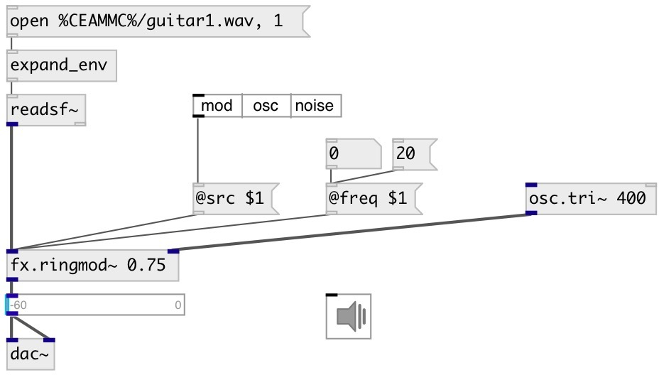

[index](index.html) :: [fx](category_fx.html)
---

# fx.ringmod~

###### ring modulator effect

*available since version:* 0.9.7

---

## arguments:

* **DRYWET**
dry/wet ratio 
_type:_ float 

## methods:

* **reset**
reset object 

## properties:

* **@src** 
Get/set modulator source. 0: modulator from second inlet, 1: internal sinusoid
oscilallator, 2: internal low freq noise. 
_type:_ int 
_range:_ 0..2 
_default:_ 0 

* **@freq** 
Get/set internal modulator frequency 
_type:_ float 
_units:_ Hz 
_range:_ 0.5..22050 
_default:_ 150 

* **@drive** 
Get/set overdrive effect after modulator 
_type:_ float 
_range:_ 1..10 
_default:_ 1 

* **@offset** 
Get/set modulator offset 
_type:_ float 
_range:_ 0..1 
_default:_ 0 

* **@drywet** 
Get/set proportion of mix between the original (dry) and &#39;effected&#39; (wet) signals. 0 -
dry signal, 1 - wet 
_type:_ float 
_range:_ 0..1 
_default:_ 0.5 

* **@bypass** 
Get/set bypass flag. If true: bypass &#39;effected&#39; signal. 
_type:_ bool 
_default:_ 0 

* **@active** 
Get/set on/off dsp processing 
_type:_ bool 
_default:_ 1 

* **@osc** (initonly)
Get/set OSC server name to listen 
_type:_ symbol 

* **@id** (initonly)
Get/set OSC address id. If specified, bind all properties to /ID/fx_ringmod/PROP_NAME
osc address, if empty bind to /fx_ringmod/PROP_NAME. 
_type:_ symbol 

## inlets:

* carrier 
_type:_ audio
* modulator 
_type:_ audio

## outlets:

* output 
_type:_ audio

## keywords:

[fx](keywords/fx.html)
[ring](keywords/ring.html)
[carrier](keywords/carrier.html)
[modulate](keywords/modulate.html)

**Authors:** Serge Poltavsky

**License:** GPL3 or later

