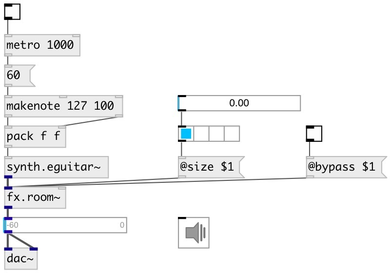

[index](index.html) :: [fx](category_fx.html)
---

# fx.room~

###### Gardners room emulation algorithms

*available since version:* 0.9.4

---

## arguments:

* **size**
echo time 
_type:_ float 
_units:_ ms 

* **diffusion**
feedback coefficient 
_type:_ float 

## methods:

* **reset**
reset to initial state 

## properties:

* **@predelay** 
Get/set pre delay 
_type:_ float 
_units:_ ms 
_range:_ 1..200 
_default:_ 20 

* **@fb** 
Get/set feedback coefficient 
_type:_ float 
_range:_ 0..1 
_default:_ 0.3 

* **@hfdamp** 
Get/set damping factor for high frequencies 
_type:_ float 
_range:_ 0..1 
_default:_ 1 

* **@size** 
Get/set room size (1: small, 2: medium, 3: large) 
_type:_ float 
_range:_ 0..3 
_default:_ 1 

* **@drywet** 
Get/set proportion of mix between the original (dry) and &#39;effected&#39; (wet) signals. 0 -
dry signal, 1 - wet 
_type:_ float 
_range:_ 0..1 
_default:_ 0.5 

* **@bypass** 
Get/set if set to 1 - bypass &#39;effected&#39; signal 
_type:_ int 
_enum:_ 0, 1 
_default:_ 0 

* **@active** 
Get/set on/off dsp processing 
_type:_ int 
_enum:_ 0, 1 
_default:_ 1 

## inlets:

* input signal 
_type:_ audio

## outlets:

* output signal 
_type:_ audio

## keywords:

[fx](keywords/fx.html)
[room](keywords/room.html)
[reverb](keywords/reverb.html)

**Authors:** Serge Poltavsky

**License:** GPL3 or later

