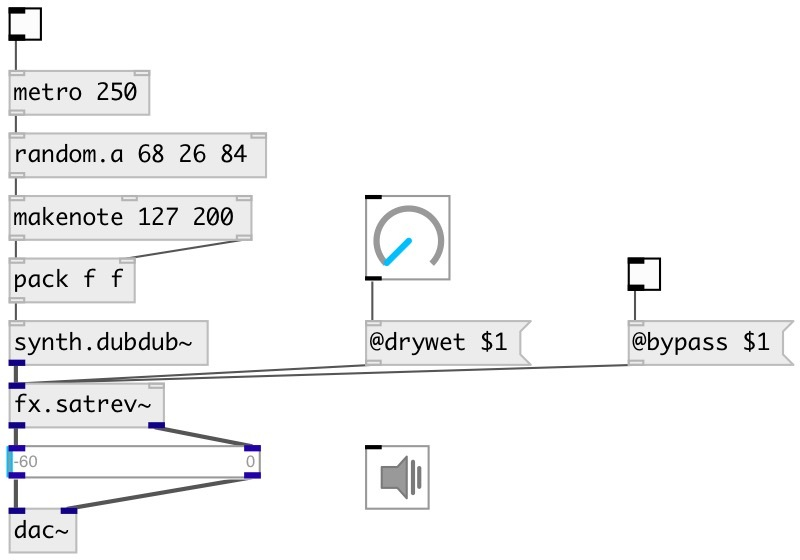

[index](index.html) :: [fx](category_fx.html)
---

# fx.satrev~

###### Schroeder reverberator from 1971

*available since version:* 0.9.6

---

## arguments:

* **DRYWET**
drywet mix 
_type:_ float 

## methods:

* **reset**
reset to initial state 

## properties:

* **@drywet** 
Get/set proportion of mix between the original (dry) and &#39;effected&#39; (wet) signals. 0 -
dry signal, 1 - wet 
_type:_ float 
_range:_ 0..1 
_default:_ 0.25 

* **@bypass** 
Get/set bypass flag. If true: bypass &#39;effected&#39; signal. 
_type:_ bool 
_default:_ 0 

* **@active** 
Get/set on/off dsp processing 
_type:_ bool 
_default:_ 1 

* **@osc** (initonly)
Get/set OSC server name to listen 
_type:_ symbol 

* **@id** (initonly)
Get/set OSC address id. If specified, bind all properties to /ID/fx_satrev/PROP_NAME
osc address, if empty bind to /fx_satrev/PROP_NAME. 
_type:_ symbol 

## inlets:

* input signal 
_type:_ audio
* set drywet 
_type:_ control

## outlets:

* left output signal 
_type:_ audio
* right output signal 
_type:_ audio

## keywords:

[fx](keywords/fx.html)
[room](keywords/room.html)
[reverb](keywords/reverb.html)
[schroeder](keywords/schroeder.html)

**Authors:** Serge Poltavsky

**License:** GPL3 or later

