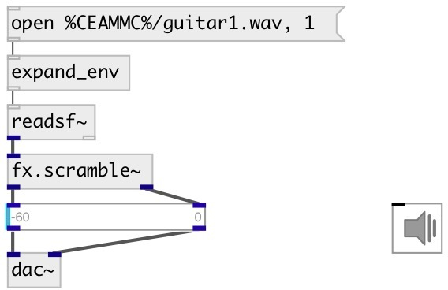

[index](index.html) :: [fx](category_fx.html)
---

# fx.scramble~

###### scramble delayed sound fragments

*available since version:* 0.9.7

---

## arguments:

* **FREQ1**
left channel scramble frequency 
_type:_ float 
_units:_ Hz 

* **FREQ2**
right channel scramble frequency 
_type:_ float 
_units:_ Hz 

## methods:

* **reset**
reset to initial state 

## properties:

* **@dev** 
Get/set scramble freq deviation 
_type:_ float 
_range:_ 0..1 
_default:_ 0.25 

* **@range** 
Get/set scramble delay amount 
_type:_ float 
_range:_ 0..1 
_default:_ 0.5 

* **@freq1** 
Get/set left channel scramble frequency 
_type:_ float 
_units:_ Hz 
_range:_ 0.25..50 
_default:_ 7 

* **@freq2** 
Get/set right channel scramble frequency 
_type:_ float 
_units:_ Hz 
_range:_ 0.25..50 
_default:_ 5 

* **@feedback** 
Get/set feedback coefficient 
_type:_ float 
_range:_ 0..0.99 
_default:_ 0.25 

* **@drywet** 
Get/set proportion of mix between the original (dry) and &#39;effected&#39; (wet) signals. 0 -
dry signal, 1 - wet 
_type:_ float 
_range:_ 0..1 
_default:_ 0.5 

* **@bypass** 
Get/set bypass flag. If true: bypass &#39;effected&#39; signal. 
_type:_ bool 
_default:_ 0 

* **@osc** (initonly)
Get/set OSC server name to listen 
_type:_ symbol 

* **@id** (initonly)
Get/set OSC address id. If specified, bind all properties to /ID/fx_scramble/PROP_NAME
osc address, if empty bind to /fx_scramble/PROP_NAME. 
_type:_ symbol 

* **@active** 
Get/set on/off dsp processing 
_type:_ bool 
_default:_ 1 

## inlets:

* input signal 
_type:_ audio

## outlets:

* left output signal 
_type:_ audio
* right output signal 
_type:_ audio

## keywords:

[fx](keywords/fx.html)
[echo](keywords/echo.html)
[delay](keywords/delay.html)

**See also:**
[\[fx.delay~\]](fx.delay~.html)

**Authors:** Serge Poltavsky

**License:** GPL3 or later

