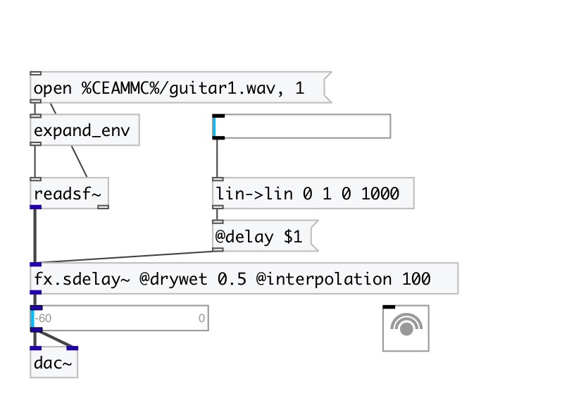

[< reference home](index.html)
---

# fx.sdelay~

smooth delay with a feedback control

---

delay that doesn&#39;t click and doesn&#39;t transpose when the delay time is
            changed
 

---

---
arguments:

delay(ms): 
            delay time 
feedback: feedback
            coefficient 

---
properties:

@delay(ms): echo time 
@feedback: feedback
            coefficient 
@interpolation(ms): interpolation time 
@drywet: proportion
            of mix between the original (dry) and &#39;effected&#39; (wet) signals. 0 - dry signal, 1 -
            wet. 
@bypass: if set to 1 - bypass
            &#39;effected&#39; signal. 
@active: on/off dsp
            processing 

---
see also: 

