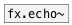

[<<< reference home](ceammc_lib.md)
---

# fx.sdelay~

```


[open %CEAMMC%/guitar1.wav, 1 #b(
|
[expand_env] [ui.hsl]
|            |
|            |
[readsf~ #a] [lin->lin 0 1 0 1000]
|            |
|            [@delay $1(
|            |
[fx.sdelay~ @drywet 0.5 @interpolation 100]
|
[ui.gain~ @size 120 16]  [ui.dsp~]
|\
[dac~]

[X a:1->b]

            
```
---
smooth delay with a feedback control
---
arguments:

delay(ms): 
            delay time<br>
feedback: feedback
            coefficient<br>

---
properties:

@delay(ms): echo time<br>
@feedback: feedback
            coefficient<br>
@interpolation(ms): interpolation time<br>
@drywet: proportion
            of mix between the original (dry) and &#39;effected&#39; (wet) signals. 0 - dry signal, 1 -
            wet.<br>
@bypass: if set to 1 - bypass
            &#39;effected&#39; signal.<br>
@active: on/off dsp
            processing<br>

---
see also:<br>
[](fx.echo~.md)
