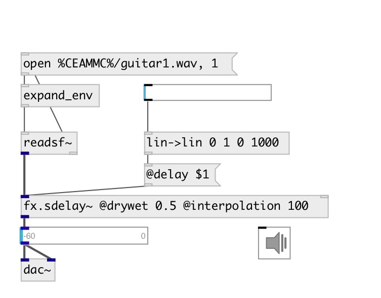

[index](index.html) :: [fx](category_fx.html)
---

# fx.sdelay~

###### smooth delay with a feedback control

*available since version:* 0.6

---

## information
delay that doesn&#39;t click and doesn&#39;t transpose when the delay time is
            changed

## arguments:

* **delay**
delay time 
_type:_ float 
_units:_ ms 

* **feedback**
feedback coefficient 
_type:_ float 

## methods:

* **clear**
clears delay line 

* **reset**
same as reset 

## properties:

* **@delay** 
Get/set echo time 
_type:_ float 
_units:_ ms 
_range:_ 0..6000 
_default:_ 1 

* **@feedback** 
Get/set feedback coefficient 
_type:_ float 
_range:_ 0..1 
_default:_ 0 

* **@interpolation** 
Get/set interpolation time 
_type:_ float 
_units:_ ms 
_range:_ 1..200 
_default:_ 20 

* **@drywet** 
Get/set proportion of mix between the original (dry) and &#39;effected&#39; (wet) signals. 0 -
dry signal, 1 - wet. 
_type:_ float 
_range:_ 0..1 
_default:_ 1 

* **@bypass** 
Get/set if set to 1 - bypass &#39;effected&#39; signal. 
_type:_ int 
_enum:_ 0, 1 
_default:_ 0 

* **@active** 
Get/set on/off dsp processing 
_type:_ int 
_enum:_ 0, 1 
_default:_ 1 

## inlets:

* input signal 
_type:_ audio

## outlets:

* output signal 
_type:_ audio

## keywords:

[fx](keywords/fx.html)
[echo](keywords/echo.html)
[delay](keywords/delay.html)

**See also:**
[\[fx.echo~\]](fx.echo~.html)

**Authors:** Yann Orlarey, Serge Poltavsky

**License:** GPL3 or later

