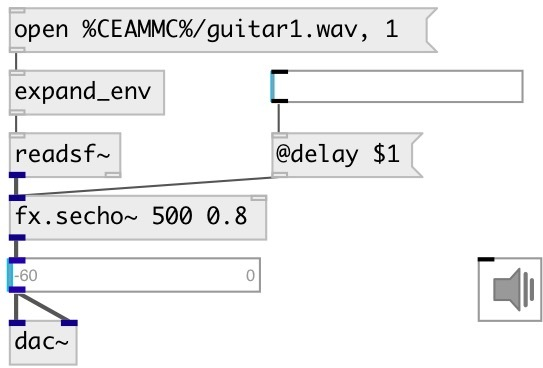

[index](index.html) :: [fx](category_fx.html)
---

# fx.secho~

###### enchanced echo effect that does not click on delay change

*available since version:* 0.9.4

---

## arguments:

* **time**
echo time 
__type:__ float 
__units:__ ms 

* **feedback**
feedback coefficient 
__type:__ float 

## methods:

* **reset**
reset to initial state 

## properties:

* **@delay** 
Get/set echo time 
__type:__ float 
__units:__ ms 
__range:__ 10..10000 
__default:__ 500 

* **@feedback** 
Get/set feedback coefficient 
__type:__ float 
__range:__ 0..0.99 
__default:__ 0.3 

* **@drywet** 
Get/set proportion of mix between the original (dry) and &#39;effected&#39; (wet) signals. 0 -
dry signal, 1 - wet 
__type:__ float 
__range:__ 0..1 
__default:__ 1 

* **@bypass** 
Get/set if set to 1 - bypass &#39;effected&#39; signal 
__type:__ int 
__enum:__ 0, 1 
__default:__ 0 

* **@active** 
Get/set on/off dsp processing 
__type:__ int 
__enum:__ 0, 1 
__default:__ 1 

## inlets:

* input signal 
__type:__ audio 

## outlets:

* output signal
__type:__ audio 

## keywords:

[fx](keywords/fx.html)
[echo](keywords/echo.html)
[delay](keywords/delay.html)

**See also:**
[\[fx.echo~\]](fx.echo~.html)
[\[fx.echo2~\]](fx.echo2~.html)

**Authors:** Serge Poltavsky

**License:** GPL3 or later

