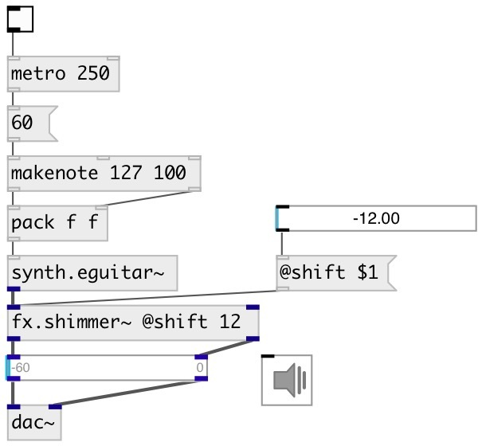

[index](index.html) :: [fx](category_fx.html)
---

# fx.shimmer~

###### shimmer reverb effect effect

*available since version:* 0.9.4

---

## arguments:

* **size**
echo time 
_type:_ float 
_units:_ ms 

* **diffusion**
feedback coefficient 
_type:_ float 

## methods:

* **reset**
reset to initial state 

## properties:

* **@decay_low** 
Get/set time (in seconds) to decay 60dB in low-frequency band 
_type:_ float 
_units:_ sec 
_range:_ 1..8 
_default:_ 3 

* **@decay_mid** 
Get/set time (in seconds) to decay 60dB in mid-frequency band 
_type:_ float 
_units:_ sec 
_range:_ 1..8 
_default:_ 2 

* **@freq_low** 
Get/set Crossover frequency (Hz) separating low and middle frequencies 
_type:_ float 
_units:_ Hz 
_range:_ 50..1000 
_default:_ 200 

* **@damp_hf** 
Get/set Frequency (Hz) at which the high-frequency T60 is half the middle-band&#39;s T60 
_type:_ float 
_units:_ Hz 
_range:_ 1500..47040 
_default:_ 6000 

* **@envelope** 
Get/set amplitude-envelope time-constant going down 
_type:_ float 
_units:_ sec 
_range:_ 0.1..3 
_default:_ 1 

* **@shift** 
Get/set frequency shifting 
_type:_ float 
_units:_ semitone 
_range:_ -12..12 
_default:_ 12 

* **@depth** 
Get/set pitchshift modulation amplitude 
_type:_ float 
_range:_ 0..1 
_default:_ 0 

* **@speed** 
Get/set pitchshift modulation frequency 
_type:_ float 
_units:_ Hz 
_range:_ 0.1..10 
_default:_ 0.1 

* **@control** 
Get/set envelope follower to pitch shifter influence coefficient 
_type:_ float 
_range:_ 0..1 
_default:_ 0.5 

* **@ps_drywet** 
Get/set proportion of mix between original and pitchshift signal in shimmer feedback 
_type:_ float 
_range:_ 0..1 
_default:_ 0.5 

* **@mode** 
Get/set correlation between pitchshift 
_type:_ int 
_range:_ -3..3 
_default:_ 0 

* **@drywet** 
Get/set proportion of mix between the original (dry) and &#39;effected&#39; (wet) signals. 0 -
dry signal, 1 - wet 
_type:_ float 
_range:_ 0..1 
_default:_ 0.5 

* **@bypass** 
Get/set if set to 1 - bypass &#39;effected&#39; signal 
_type:_ int 
_enum:_ 0, 1 
_default:_ 0 

* **@active** 
Get/set on/off dsp processing 
_type:_ int 
_enum:_ 0, 1 
_default:_ 1 

## inlets:

* input signal 
_type:_ audio
* input signal 
_type:_ audio

## outlets:

* output signal 
_type:_ audio
* output signal 
_type:_ audio

## keywords:

[fx](keywords/fx.html)
[echo](keywords/echo.html)
[shimmer](keywords/shimmer.html)
[reverb](keywords/reverb.html)

**Authors:** thedrgreenthumb, Serge Poltavsky

**License:** GPL3 or later

