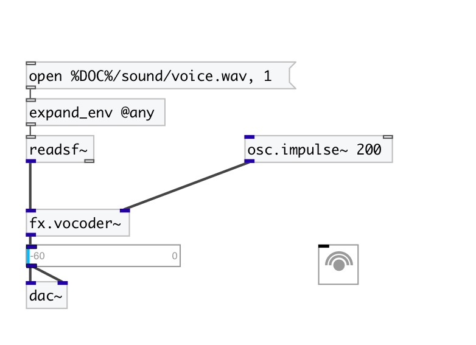

[< reference home](index.html)
---

# fx.vocoder~

very simple vocoder where the spectrum of the modulation signal is
            analyzed using a 32-band filter bank

---

 

---

---
arguments:

---
properties:

@attack(ms): attack time 
@release(ms): release time 
@bwratio: 
            coefficient to adjust the bandwidth of each band 
@active: on/off dsp
            processing 

