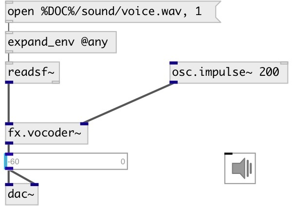

[index](index.html) :: [fx](category_fx.html)
---

# fx.vocoder~

###### very simple vocoder where the spectrum of the modulation signal is
            analyzed using a 32-band filter bank

*available since version:* 0.7

---

## properties:

* **@attack** 
Get/set attack time 
__type:__ float 
__units:__ ms 
__range:__ 0.1..100 
__default:__ 5 

* **@release** 
Get/set release time 
__type:__ float 
__units:__ ms 
__range:__ 0.1..100 
__default:__ 5 

* **@bwratio** 
Get/set coefficient to adjust the bandwidth of each band 
__type:__ float 
__range:__ 0.1..2 
__default:__ 0.5 

* **@active** 
Get/set on/off dsp processing 
__type:__ int 
__enum:__ 0, 1 
__default:__ 1 

## inlets:

* modulation signal 
__type:__ audio 
* excitation/carrier signal 
__type:__ audio 

## outlets:

* None
__type:__ audio 

## keywords:

[vocoder](keywords/vocoder.html)

**Authors:** Serge Poltavsky

**License:** GPL3 or later

