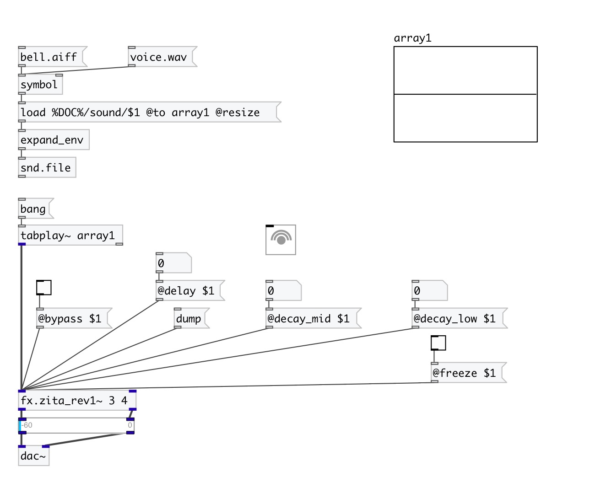

[< reference home](index.html)
---

# fx.zita_rev1~

Zita stereo reverb

---

 

---

---
arguments:

decay_low(sec): time
            (in seconds) to decay 60dB in low-frequency band 
decay_mid(sec): time
            (in seconds) to decay 60dB in mid-frequency band 

---
properties:

@decay_low(sec): time (in seconds) to decay 60dB in low-frequency band 
@decay_mid(sec): time (in seconds) to decay 60dB in mid-frequency band 
@delay(ms): A delay of 20 to 100 ms operating on the &#39;wet&#39; signal. Large values
            will provide the impression of a larger room 
@freq_low(Hz): Crossover frequency (Hz) separating low and middle frequencies 
@dump_hf(Hz): Frequency (Hz) at which the high-frequency T60 is half the middle-band&#39;s
            T60 
@drywet: Ratio
            between processed signal (wet) and source signal 
@bypass: if set to 1 - bypass
            &#39;effected&#39; signal. 
@active: on/off dsp
            processing 

