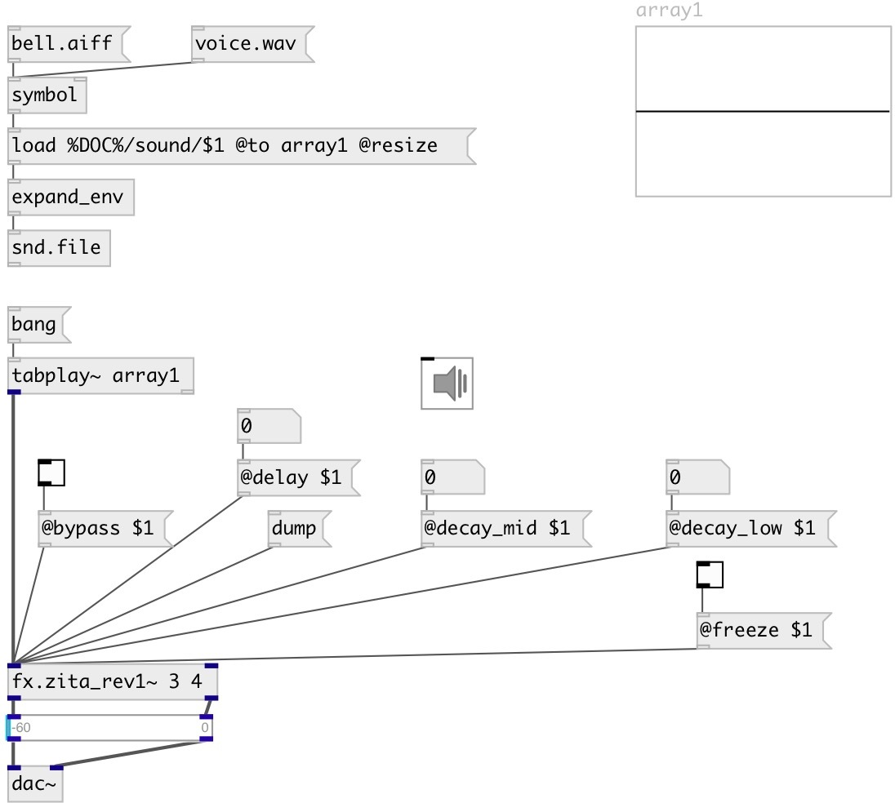

[index](index.html) :: [fx](category_fx.html)
---

# fx.zita_rev1~

###### Zita stereo reverb

*available since version:* 0.2

---

## arguments:

* **decay_low**
time (in seconds) to decay 60dB in low-frequency band 
__type:__ float 
__units:__ sec 

* **decay_mid**
time (in seconds) to decay 60dB in mid-frequency band 
__type:__ float 
__units:__ sec 

## methods:

* **reset**
same as reset 

## properties:

* **@decay_low** 
Get/set time (in seconds) to decay 60dB in low-frequency band 
__type:__ float 
__units:__ sec 
__range:__ 1..60 
__default:__ 3 

* **@decay_mid** 
Get/set time (in seconds) to decay 60dB in mid-frequency band 
__type:__ float 
__units:__ sec 
__range:__ 1..60 
__default:__ 2 

* **@delay** 
Get/set a delay of 20 to 100 ms operating on the &#39;wet&#39; signal. Large values will
provide the impression of a larger room 
__type:__ float 
__units:__ ms 
__range:__ 20..100 
__default:__ 60 

* **@freq_low** 
Get/set Crossover frequency (Hz) separating low and middle frequencies 
__type:__ float 
__units:__ Hz 
__range:__ 50..1000 
__default:__ 200 

* **@damp_hf** 
Get/set Frequency (Hz) at which the high-frequency T60 is half the middle-band&#39;s T60 
__type:__ float 
__units:__ Hz 
__range:__ 1500..47040 
__default:__ 6000 

* **@drywet** 
Get/set Ratio between processed signal (wet) and source signal 
__type:__ float 
__range:__ 0..1 
__default:__ 1 

* **@bypass** 
Get/set if set to 1 - bypass &#39;effected&#39; signal. 
__type:__ int 
__enum:__ 0, 1 
__default:__ 0 

* **@active** 
Get/set on/off dsp processing 
__type:__ int 
__enum:__ 0, 1 
__default:__ 1 

* **@freeze** 
Get/set freeze reverberation tail 
__type:__ int 
__enum:__ 0, 1 
__default:__ 0 

* **@fr_mdecay** 
Get/set time (in seconds) to decay 60dB in mid-frequency band 
__type:__ float 
__units:__ sec 
__range:__ 0..60 
__default:__ 40 

* **@fr_ldecay** 
Get/set time (in seconds) to decay 60dB in low-frequency band 
__type:__ float 
__units:__ sec 
__range:__ 0..60 
__default:__ 40 

* **@fr_time** 
Get/set length of freeze tail 
__type:__ float 
__units:__ ms 
__range:__ 0..1000 
__default:__ 100 

## inlets:

* left channel 
__type:__ audio 
* right channel 
__type:__ audio 

## outlets:

* output left
__type:__ audio 
* output right
__type:__ audio 

## keywords:

[fx](keywords/fx.html)
[reverb](keywords/reverb.html)

**Authors:** Serge Poltavsky

**License:** GPL3 or later

