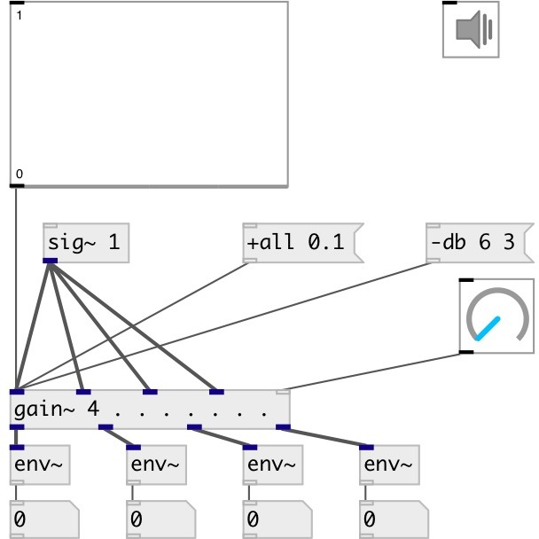

[index](index.html) :: [base](category_base.html)
---

# gain~
**aliases:** [ceammc/gain\~]

###### multislot signal gain

*available since version:* 0.6

---

## arguments:

* **N**
number of inputs/outputs 
_type:_ int 

## methods:

* **+**
increase gain amplitude 
  __parameters:__
  - **[VALS]** values for each input channel 
    type: list  

* **-**
decrease gain amplitude 
  __parameters:__
  - **[VALS]** values for each input channel 
    type: list  

* **+db**
increase gain in db 
  __parameters:__
  - **[VALS]** values for each input channel 
    type: list  

* **-db**
decrease gain in db 
  __parameters:__
  - **[VALS]** values for each input channel 
    type: list  

* **+all**
increase gain amplitude for all inputs 
  __parameters:__
  - **V** single value for each input channel 
    type: float  
    required: True  

* **-all**
decrease gain amplitude for all inputs 
  __parameters:__
  - **V** single value for each input channel 
    type: float  
    required: True  

* **set**
set gain amplitude for all inputs 
  __parameters:__
  - **V** new gain value 
    type: float  
    required: True  

* **set_db**
set gain in db for all inputs 
  __parameters:__
  - **V** new gain value 
    type: float  
    required: True  

## properties:

* **@value** 
Get/set gain amplitude values 
_type:_ list 
_min value:_ 0 
_default:_ 0 

* **@db** 
Get/set gain decibel (dbfs) values 
_type:_ list 
_min value:_ -144 
_default:_ -144 

* **@smooth_time** 
Get/set gain change smooth time 
_type:_ float 
_units:_ ms 
_min value:_ 1 
_default:_ 20 

## inlets:

* input signal 
_type:_ audio
* input signal 
_type:_ audio
* set gain for all inputs 
_type:_ control

## outlets:

* output signal 
_type:_ audio
* output signal 
_type:_ audio
* output signal 
_type:_ audio

## keywords:

[gain](keywords/gain.html)
[amplitude](keywords/amplitude.html)
[decibel](keywords/decibel.html)

**Authors:** Serge Poltavsky

**License:** GPL3 or later

