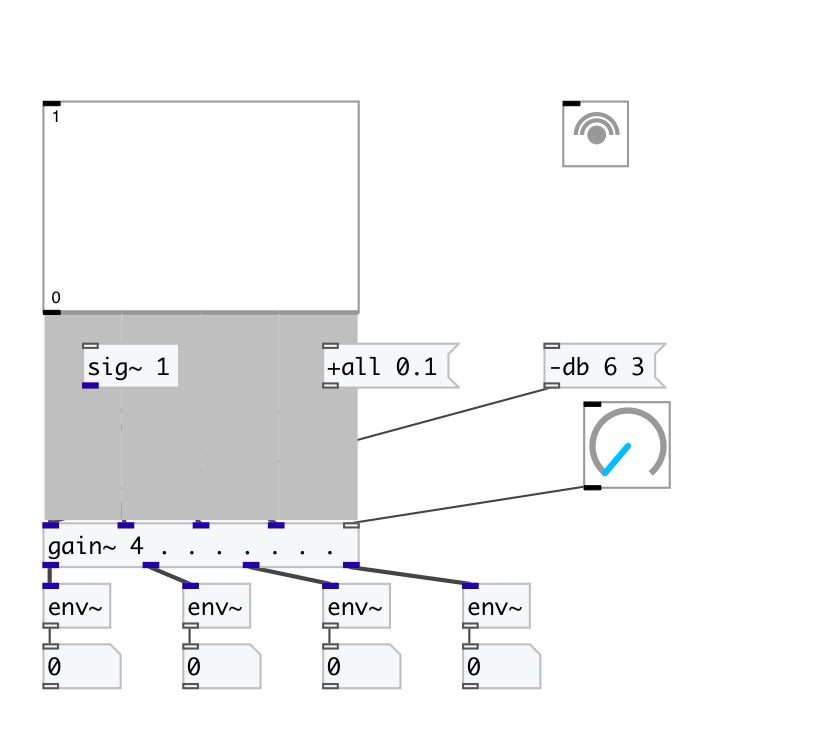

[< reference home](index.html)
---

# gain~

multislot signal gain

---

 

---

---
arguments:

N: number of
            inputs/outputs 

---
properties:

@value: gain amplitude
            values 
@db: gain decibel (dbfs)
            values 
@smooth_time(ms): gain change smooth time 

