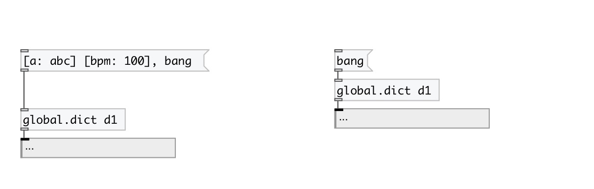
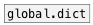

[< reference home](index.html)
---

# global.dict

global named dict object

---

Defines global scope dict variable, accessed by ID name and available fro
            everywhere
 

---

---
arguments:

ID: object ID 

---
properties:

@keys: keys of dictionary 
@empty: 1 if dict is
            empty, otherwise 0 
@size: number of
            entries in dictionary 

---
see also: 

