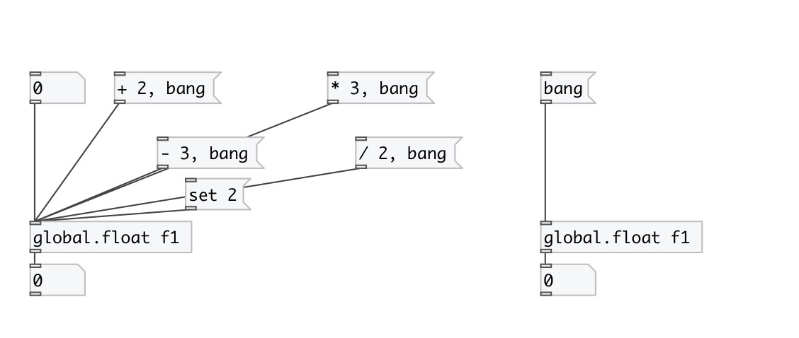

[< reference home](index.html)
---

# global.float

global named float object

---

Defines global scope float variable, accessed by ID name.
 

---

---
arguments:

ID: object ID 

---
properties:

@value: current
            value 

---
see also: 

