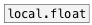

[< reference home](ceammc_lib.html)
---

# global.float


global named float object

```


[F]   [+ 2, bang(    [* 3, bang(    [bang(
|     |              |              |
|     |              |              |
|     |  [- 3, bang( | [/ 2, bang(  |
|     |  |           | |            |
|     |  | [set 2(   | |            |
|     |  | |         | |            |
[global.float        f1]            [global.float f1]
|                                   |
[F]                                 [F]

            
```

---
arguments:

ID: object ID<br>

---
properties:

@value: current
            value<br>

---
see also:<br>
[](local.float.html)
[](global.int.html)
