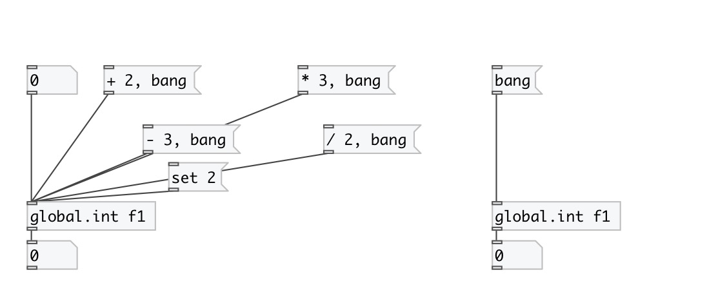

[< reference home](index.html)
---

# global.int

global named integer object

---

Defines global scope integer variable, accessed by ID name.
 

---

---
arguments:

ID: object ID 

---
properties:

@value: current value 

---
see also: 

