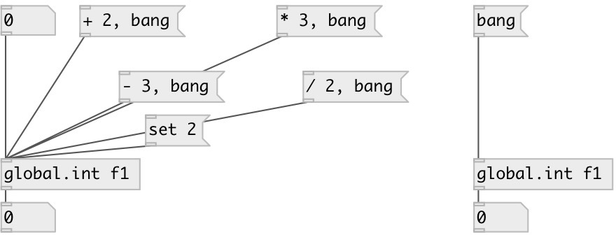

[index](index.html) :: [global](category_global.html)
---

# global.int

###### global named integer object

*available since version:* 0.1

---

## information
Defines global scope integer variable, accessed by ID name.

## arguments:

* **ID**
object ID 
_type:_ symbol 

## methods:

* **set**
sets new value without output 

* **+**
add to int, no output 

* **-**
substruct from int, no output 

* *****
multiply to, no output 

* **/**
divide by, no output 

## properties:

* **@value** (readonly)
Get current value 
_type:_ int 
_default:_ 0 

## inlets:

* outputs variable 
_type:_ control

## outlets:

* int output 
_type:_ control

## keywords:

[int](keywords/int.html)
[global](keywords/global.html)

**See also:**
[\[global.float\]](global.float.html)

**Authors:** Serge Poltavsky

**License:** GPL3 or later

