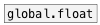
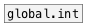

[< reference home](ceammc_lib.html)
---

# global.list


global named list object

---

Defines global scope list variable, accessed by ID name.<br>


---


```


[list a b c(  [set 3 2 1(
|             |
|  [1 2 3(    |            [bng]
|  |          |            |
[global.list id]           [global.list id]
|                          |
[msg set]                  [msg set]
|                          |
[ (                        [ (

            
```

---
arguments:

ID: object ID<br>

---
properties:

@empty: 1 if list is
            empty, otherwise 0<br>
@size: number of
            elements in list<br>

---
see also:<br>
[](global.float.html)
[](global.int.html)
