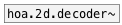

# hoa.2d.encoder~

```


[lfo.square~ 1]                    [phasor~ 0.15]
|                                  |
[ui.gain~ @size 120 14]            [phase->rad~]
|                              .___/ |
[hoa.encoder~ 5 {w=24,i=11,o=11}]  [ui.n~]
*|*
[hoa.scope~ @order 5 {i=11} @size 171 171]


[ui.dsp~]

            
```
---
arguments:

ORDER: the order of
            decomposition<br>

---
properties:

@order: the order of decomposition<br>

see also:<br>

