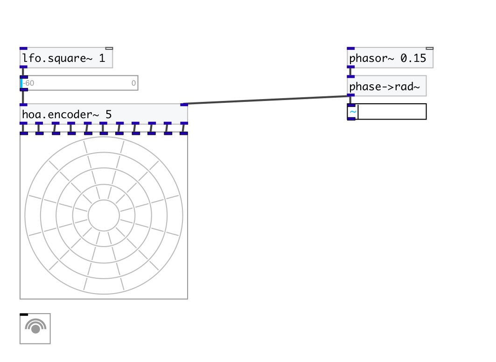

[< reference home](index.html)
---

# hoa.2d.encoder~

hoa 2d encoder

---

Creates the circular harmonics of a signal depending of a given order and a
            position on a circle given in radians (θ).
 

---

---
arguments:

ORDER: the order of
            decomposition 

---
properties:

@order: the order of decomposition 

---
see also: 

